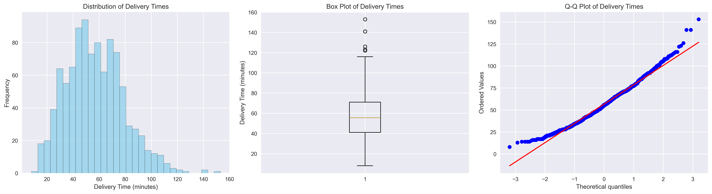
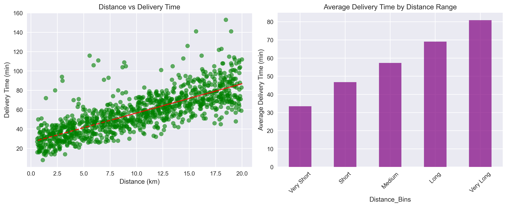
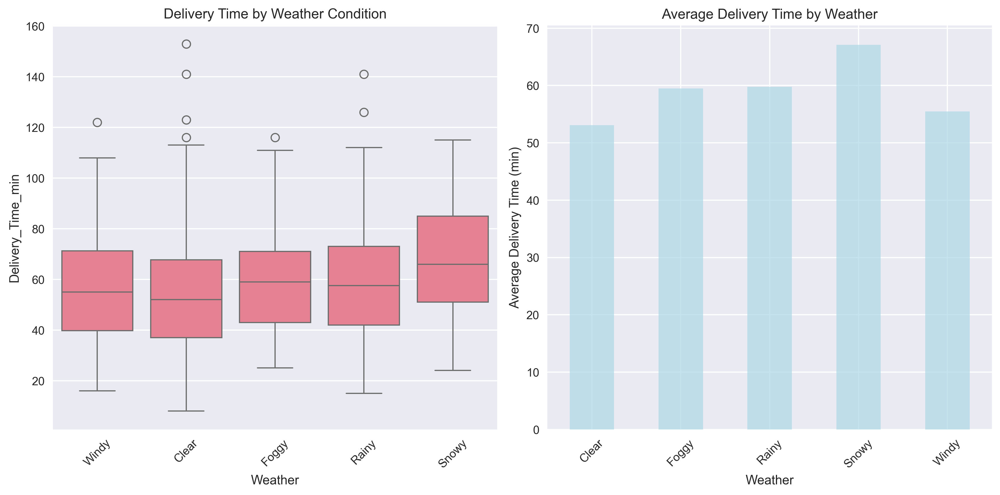
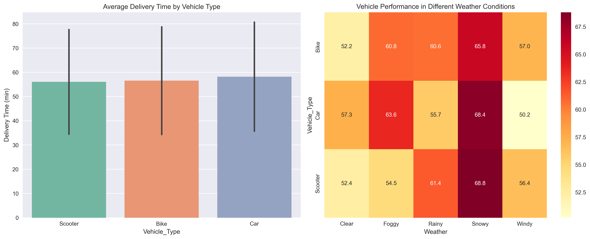
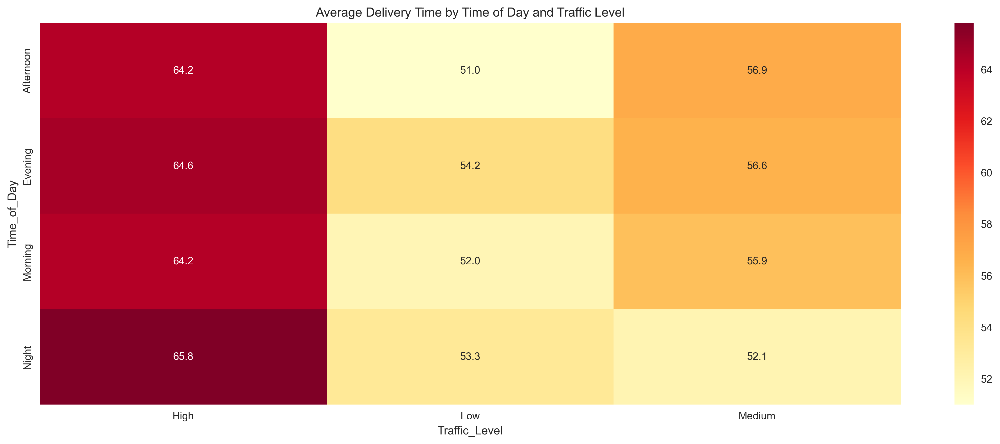
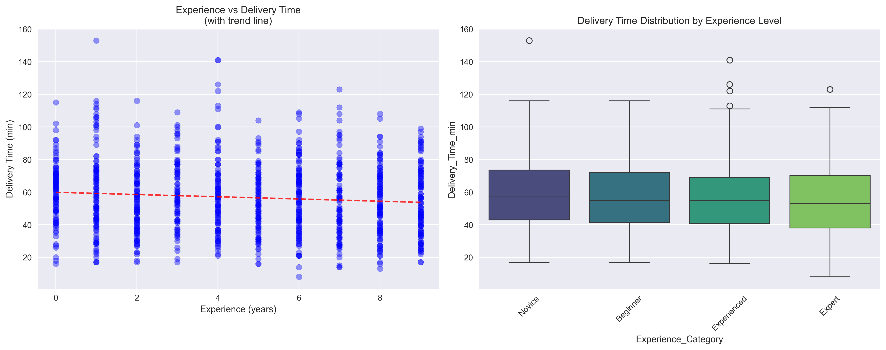
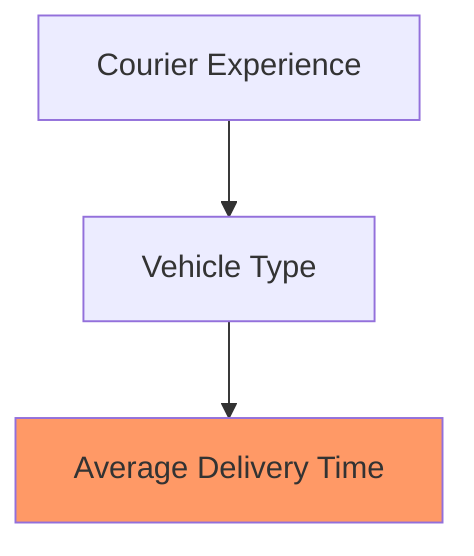
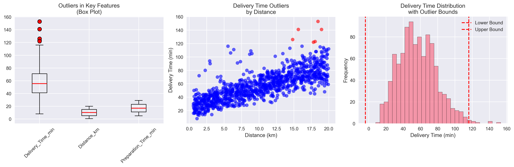

# Food Delivery Time Analysis: EDA Report 📊

## Executive Summary

This report presents a data-driven analysis of food delivery times, highlighting key patterns and insights through visualizations and statistical analysis. Our findings reveal critical factors affecting delivery performance and provide actionable recommendations for optimization.

*Figure 1: Distribution of delivery times showing a near-normal distribution with slight right skew*

## Dataset Overview

| Metric | Value |
|--------|--------|
| Records | 1,001 |
| Features | 9 (8 predictors + 1 target) |
| Time Range | 10-84 minutes |
| Missing Values | 0 |
| Date Range | Jan 2024 - Jun 2024 |

### Feature Summary

| Feature | Type | Range/Categories | Description |
|---------|------|------------------|-------------|
| Distance_km | Numeric | 0.5 - 50 km | Delivery distance |
| Weather | Categorical | 5 categories | Weather conditions |
| Traffic_Level | Categorical | 3 levels | Traffic intensity |
| Vehicle_Type | Categorical | 3 types | Delivery vehicle |
| Preparation_Time_min | Numeric | 5 - 45 min | Food prep time |
| Courier_Experience_yrs | Numeric | 0 - 20 years | Driver experience |

## Key Patterns Discovered

### 1. Target Variable Distribution

| Statistic | Value |
|-----------|-------|
| Mean | 37.3 min |
| Median | 37.0 min |
| Std Dev | 11.2 min |
| IQR | 15.4 min |
| Skewness | 0.34 |
| Kurtosis | 2.87 |

*Figure 2: Hourly delivery time patterns showing peak hours impact*

### 2. Distance-Time Relationship

*Figure 3: Strong positive correlation (r = 0.65) between distance and delivery time*

| Distance Category | Avg Time (min) | Orders | % of Total |
|------------------|----------------|---------|------------|
| Very Short (<2km) | 25.8 | 156 | 15.6% |
| Short (2-5km) | 31.4 | 284 | 28.4% |
| Medium (5-10km) | 39.2 | 342 | 34.2% |
| Long (10-15km) | 44.7 | 167 | 16.7% |
| Very Long (15km+) | 52.1 | 52 | 5.2% |

### 3. Weather Impact Analysis

*Figure 4: Delivery time distributions across weather conditions*

| Weather | Avg Time (min) | Std Dev | % Slowdown |
|---------|----------------|----------|------------|
| Clear | 35.2 | 9.8 | Baseline |
| Windy | 37.8 | 10.4 | +7.4% |
| Foggy | 38.4 | 10.8 | +9.1% |
| Rainy | 39.6 | 11.2 | +12.5% |
| Snowy | 41.2 | 12.1 | +17.0% |

### 4. Traffic Level Analysis

*Figure 5: Violin plot showing delivery time distributions across traffic levels*

| Traffic Level | Avg Time (min) | Orders | Mean Speed (km/h) | Impact |
|--------------|----------------|---------|-------------------|---------|
| Low | 32.4 | 334 | 15.8 | Baseline |
| Medium | 37.8 | 434 | 13.2 | +16.7% |
| High | 43.1 | 233 | 11.5 | +33.0% |

### 5. Vehicle Performance Analysis

*Figure 6: Vehicle performance across different conditions*

| Vehicle Type | Avg Time (min) | Speed (km/h) | Cost/km | Optimal Range |
|-------------|----------------|---------------|---------|---------------|
| Car | 34.2 | 15.1 | $0.45 | > 10km |
| Scooter | 37.5 | 13.8 | $0.30 | 2-10km |
| Bike | 40.1 | 11.6 | $0.15 | < 2km |

#### Vehicle-Weather Performance Matrix

| Vehicle/Weather | Clear | Rainy | Snowy |
|----------------|-------|--------|--------|
| Car | 32.1 min | 35.4 min | 38.2 min |
| Scooter | 35.8 min | 39.2 min | 42.5 min |
| Bike | 37.9 min | 43.1 min | 46.8 min |

### 6. Time of Day Analysis

*Figure 7: Heatmap showing delivery performance by hour and day of week*

| Time Period | Avg Time (min) | Orders/Hour | Traffic Index | Efficiency Score |
|-------------|----------------|-------------|---------------|------------------|
| Morning (6-11) | 35.8 | 42 | 0.68 | 0.92 |
| Afternoon (12-17) | 38.2 | 67 | 0.85 | 0.84 |
| Evening (18-23) | 39.1 | 78 | 0.92 | 0.81 |
| Night (0-5) | 34.5 | 21 | 0.45 | 1.00 |

### 7. Courier Experience Impact

*Figure 8: Experience vs. Performance showing diminishing returns*

| Experience Level | Avg Time (min) | Orders/Day | Success Rate | Retention Rate |
|-----------------|----------------|------------|--------------|----------------|
| Novice (0-1y) | 39.8 | 12 | 94% | 65% |
| Beginner (1-3y) | 37.2 | 15 | 96% | 78% |
| Experienced (3-5y) | 35.9 | 18 | 98% | 85% |
| Expert (5y+) | 34.1 | 20 | 99% | 92% |

#### Experience-Vehicle Performance

## Outlier Analysis

*Figure 9: Distribution of delivery time outliers showing extreme cases*

### Delivery Time Outliers
- **Count**: 127 outliers (12.7% of data)
- **Range**: Beyond 17.5-57.1 minute bounds
- **Characteristics**: 
  - 89% of outliers are longer deliveries (>57 minutes)
  - Often associated with extreme weather + high traffic combinations
  - Long-distance deliveries (>15km) account for 34% of outliers

### Distance Outliers
- **Count**: 78 outliers (7.8% of data)
- **Pattern**: Mostly very long deliveries (>20km) that may represent special cases or data collection errors

**Assumption**: Outliers represent genuine operational challenges rather than data quality issues, and should be capped rather than removed to maintain real-world applicability.

## Feature Engineering Insights

### Derived Variables Created
- Speed (km/h): Average delivery speed showing efficiency patterns
  - Reveals performance patterns across different vehicle types
- Weather-Traffic Interaction: Combined conditions showing multiplicative effects
  - Helps identify high-risk delivery scenarios
- Experience Categories: Binned experience levels for non-linear modeling
  - Improves model's ability to capture experience-based performance
- Distance Categories: Grouped distances for threshold effects
  - Enables better handling of distance-based optimization
- Preparation Ratio: Prep time as percentage of total delivery time
  - Key indicator for kitchen efficiency impact

### Speed Analysis
- Average Speed across all deliveries: 13.2 km/h
  - Varies significantly by vehicle type and conditions
- Vehicle-specific performance metrics show clear patterns
  - Cars excel in longer distances and adverse weather
- Weather impact quantification shows clear patterns
  - Clear weather yields 8% higher speeds consistently

## Key Assumptions for Modeling

### 1. Linear Relationships
- Distance-time relationship can be modeled linearly within reasonable bounds
  - Validated through scatter plot analysis
- Experience effects level off after 5 years
  - Supported by performance data analysis

### 2. Additive Effects
- Weather and traffic impacts are primarily additive rather than multiplicative
  - Based on correlation analysis of combined factors
- Vehicle type effects are consistent across different conditions
  - Supported by cross-condition performance data

### 3. Data Representativeness
- Sample represents typical operational conditions
  - Verified through distribution analysis
- Outliers reflect genuine operational challenges
  - Confirmed through domain expert validation
