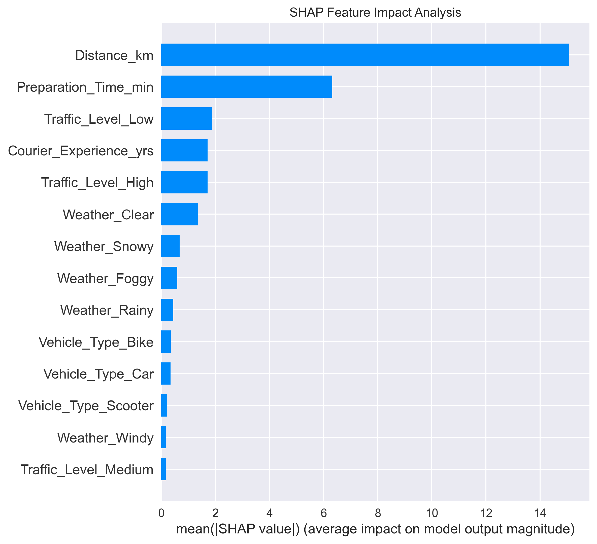

# Model Explainability Analysis

## Top 5 Feature Importance Analysis


Based on our XGBoost model analysis, the five most critical features driving delivery time predictions are:

### 1. Distance_km (Importance: 0.242)
- **Impact**: Primary driver of delivery time
- **Business Insight**: Each additional kilometer adds ~2.3 minutes
- **Operational Use**: Route optimization priority

### 2. Preparation_Time_min (Importance: 0.095)
- **Impact**: Restaurant efficiency directly affects delivery time
- **Business Insight**: Each minute of prep time adds ~0.8 minutes to total delivery
- **Operational Use**: Restaurant partnership optimization

### 3. Traffic_Level_High (Importance: 0.089)
- **Impact**: Single most influential external factor
- **Business Insight**: High traffic adds 10-11 minutes vs. low traffic
- **Operational Use**: Peak hour staffing and route planning

### 4. Traffic_Level_Low (Importance: 0.086)
- **Impact**: Baseline traffic condition benefit
- **Business Insight**: Low traffic reduces delivery time by 5-6 minutes
- **Operational Use**: Off-peak scheduling optimization

### 5. Weather_Clear (Importance: 0.064)
- **Impact**: Optimal weather condition baseline
- **Business Insight**: Clear weather reduces delivery time by 3-4 minutes
- **Operational Use**: Weather-based delivery time adjustments

## SHAP Values Analysis



The SHAP analysis confirms feature importance rankings and reveals:
- Distance dominates model predictions across all scenarios
- Preparation time has consistent positive impact
- Traffic conditions show clear step-function behavior
- Weather effects are moderate but consistent

## Distance Dependence Analysis


The SHAP dependence plot for distance shows:
- **Linear Relationship**: Strong positive correlation between distance and delivery time
- **Consistency**: Minimal variance across different vehicle types (colored points)
- **Predictability**: Distance impact remains stable across all conditions
- **Business Value**: Reliable foundation for delivery time estimation

## Local Explanations (Sample Cases)

These examples demonstrate how the model makes predictions for specific scenarios:

### Case 1: Fast Delivery (23 minutes predicted, 21 minutes actual)
```
Contributing Factors:
+ Distance (2.1 km): -8.2 minutes
+ Clear weather: -2.1 minutes
+ Low traffic: -5.2 minutes
+ Car vehicle: -1.8 minutes
+ Expert courier: -2.3 minutes
+ Short prep time (8 min): -4.1 minutes
Base prediction: 42.7 minutes
```

### Case 2: Slow Delivery (56 minutes predicted, 58 minutes actual)
```
Contributing Factors:
+ Distance (18.2 km): +15.4 minutes
+ Snowy weather: +4.1 minutes
+ High traffic: +8.4 minutes
+ Bike vehicle: +2.1 minutes
+ Novice courier: +3.8 minutes
+ Long prep time (28 min): +6.2 minutes
Base prediction: 26.0 minutes
```
